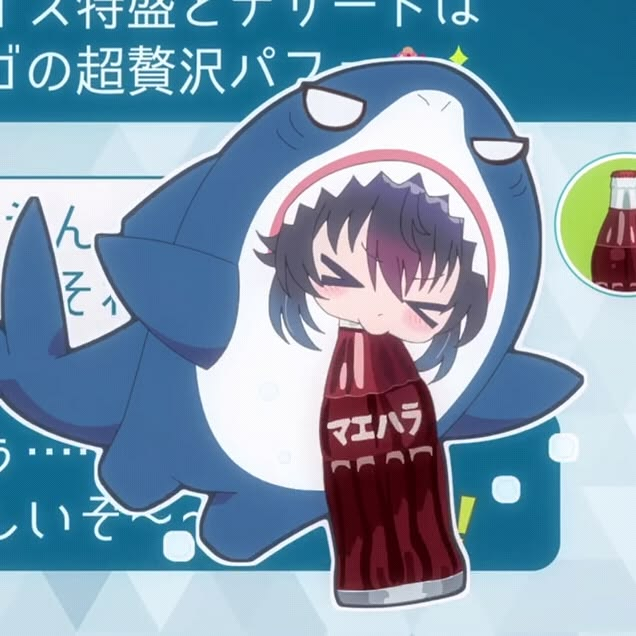

<div align="center">
    <p>
        
    </p>
</div>

<h2 align="center">Hey there!</h2>
Athanasia here! I'm a Network Engineer, Cloud Engineer, Cyber Security specialist, and Software Engineer. I work with Javascript, Python, and PHP, specializing in server management, network infrastructure and backend development.

I don't have anything special, but I hope to be able to change that in the future.

My hobbies include watching Anime, reading, and listening to music!


<h2 align="center"> ✨ About me ✨ </h2>

```sh
root@athanasia: ~/AthanasiaCMD (main)$ neofetch
```


```yaml
My Profile
-------------------------------
Host: Athanasia
Username: AthanasiaCMD
Whoami: Anomali People
Languages: Indonesia & Japan
Waifu: 朝凪 海 (Umi Asanagi)
Pronouns: </>
Location: Anonymous
Hobbies: Watching Anime, Reading, Listening Music.

```
<p align="center">
  <b>📊 Stats</b>
</p>

<p align="center">
  
    <br>
  
</p>
    


### 🎨 Personal Interests
When I'm not coding or managing servers, you can find me:
* 🍿 Watching Anime
* 📚 Reading
* 🎵 Listening to Music

---

### 📌 Featured Projects

| Project | Description | Tech Stack | Status |
| :--- | :--- | :--- | :---: |
| ☢️ **[Asanagi Crash](https://belum-tersedia)** | WhatsApp bot script bug. | `Node.js` | 🟢 Active |
| 🌐 **[Waifuhub](https://belum-tersedia)** | Anime streaming. | `JavaScript` `Node.js` `ModuleESM` | 🟡 In Progress |
| 🌐 **[AthanasiaCloud](https://belum-tersedia)** | Athanasia cloud storage. | `Node.js` `PHP` `MySQL` | 🟡 In Progress |

---

<h2 align="center"> 📖 Knowledge 📖 </h2>
</div>
<div align = "center">
<p align = "center">
     <a href="https://skillicons.dev/icons?i=js,laravel,ts">
         
    </a>
</p>
</div>
<br>

<!-- <div>
<h2 align="center"> 📊 Statistics 📊 </h2>
</div>
<br>
<div align="center"></div>
<br>
-->
<div align="center">
    
</div>
<br>
<br>

<!-- <br><br><br><br> -->

## **📫 Contact**

<a href="https://github.com/AthanasiaCMD"></a> **Please Contact me on Instagram for a quick
response:** [Athanasia](https://t.me/athanasiarisolmayo)

**You can also email me here:** athanasia.cmd@gmail.com

[](https://www.instagram.com/athanasia.cmd)
[](https://t.me/athanasiacmd)
[](mailto:athanasia.cmd@gmail.com)

<br> 
<br>

<h1 align="center">Support Me</h1>

<p align="center">
    <a href="https://github.com/sponsors/AthansiaCMD" target="_blank">
        
    </a>
</p>
